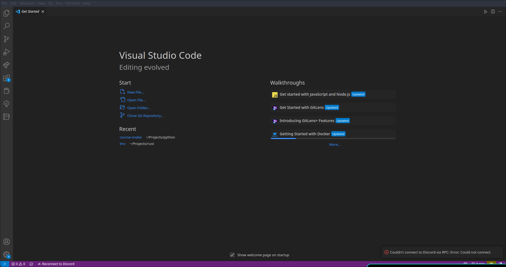
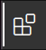
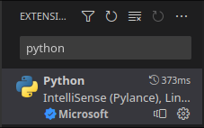
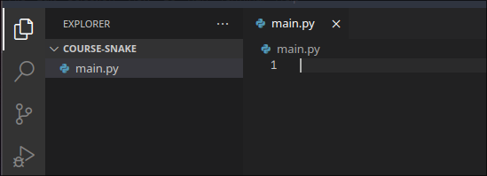
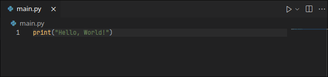

# Getting Started

This aims to provide setup instructions and conventions for the course.

The setup instructions assume you are on windows - if you are not then let me know before the course!

## Python

The first step we need to do is to install python - this *is* a python course after all! Go to the [official python download page](https://www.python.org/downloads/) and click the yellow "Download Python 3.11" button. Open File explorer and navigate to your "Downloads" folder. Double-click to open the file named "Python-3.11.1", or similar. Make doubly sure the "Add Python 3.11 to PATH" option is checked at the bottom - this is very important. Then click "Install Now", and wait whilst python is installed. Once it is done, close the installer.

To verify it is installed correctly, open the start menu and search for "Command Prompt". Type in `python --version`. It should print out something like "Python 3.11.1". Next, we need to verify `pip` is installed. Pip is a 'package manager' for python, and will allow us to install pygame - the library used in the course. Enter `pip --version`. This should print out something like "Pip 22.3.1". The final step is to enter the command `pip install pygame`. If all 3 commands don't report errors, everything is installed successfully!

## Install Visual Studio Code

To get started writing python, the first step is to install a *code editor*. A good first choice for beginners is VS Code.

Open [this link](https://code.visualstudio.com/), you should see a blue download button saying  "Download for Windows" - click this. Then, navigate to your Downloads folder in File Explorer and double-click the file named "VSCodeUserSetup" (or similar). Accept the terms and conditions and click through until it says "Install". Press this and wait as VSC is installed to your computer. If, when you close the installer VSC does not open, you can open it from the Windows Start Menu.

You should now see a window that looks something like this (it will look slightly different, but that's okay):



Click on the extensions option on the toolbar on the right - it is the button with the icon that looks like this:



At the top of the page there should be a search bar, enter into it "Python". Select the extension that looks like this:



A window should open in the middle of the screen. Click "Install", and wait whilst the extension is installed.

The next step is to create our project directory - this is where we will place our code. Click on "File" on the status bar at the top, then select "Open Folder" and navigate to your user home directory (the folder containing "Documents", "Downloads" ect..) if it is not already open. Create a new folder, and name it "Projects". Open this folder and create another folder named "course-snake". Click on this folder, then click on the "Open Folder" button in the bottom right.

Next, click on the "Files" icon in the top-left, to open a sidebar on the left. Right-click under the "course-snake" tab and select "New File". Type in `main.py` and press enter. A window should open in the middle, displaying a blank file. At this point, the screen should look something like this:



 Enter into this file the following code - we will cover what it means later on.

```python
print("Hello, World!")
```

Select the arrow next to the "triangle" run button in the top-right of the window:



From the drop-down menu that appears, select "Run Python File". At the bottom of the window, a new terminal popup should appear. If all goes well, you should see the text "Hello, World" being printed to the terminal.

If this worked, congratulations! You are all set-up!

## Notes

We use "Bobirty Quandale" as our default string content. Long story :P

The output of programs is follows `>>` in code snippets, ex.

```python
print("Bobirty")
>> Bobirty
```

Advanced or extra information is denoted by `[<topic name>]` in text. At the bottom of each page should be a Notes header, which contains the extra information.
